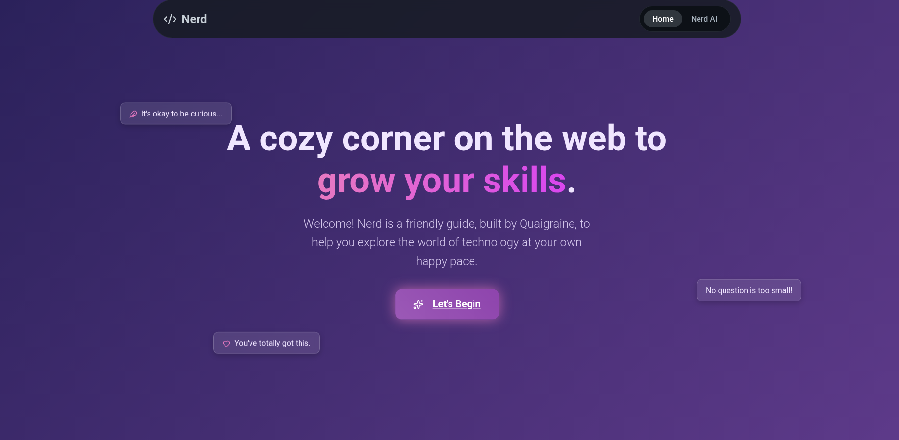

# 🧠 Nerd AI

Nerd is a welcoming, personalized AI chat application built with React and the Gemini API to help friends learn programming in a cozy, supportive environment.

 

---

## ✨ Features

* **Personalized Experience**: The AI greets users by name (and even uses nicknames!), creating a friendly and welcoming atmosphere from the start.
* **Gemini-Powered Tutor**: Leverages the Google Gemini API with a custom system prompt to act as a patient and encouraging programming tutor.
* **Persistent Chat History**: Saves conversations to the browser's local storage, allowing users to access and review previous chats in a convenient sidebar.
* **Creative & Responsive UI**: A beautiful, fully responsive "cosmic library" theme built with Styled Components, ensuring a great experience on any device.
* **Modern Tech Stack**: Built with React, Vite, React Router, Styled Components, and Lucide Icons.

---

## 🛠️ Getting Started

### Prerequisites

* Node.js (v18 or later)
* npm, yarn, or pnpm

### Installation

1.  **Clone the repository:**
    ```sh
    git clone [https://github.com/your-username/nerd.git](https://github.com/samuel6814/nerd.git)
    cd nerd
    ```

2.  **Install dependencies:**
    ```sh
    npm install
    ```

3.  **Set up your environment variables:**
    Create a file named `.env` in the root of your project and add your Google Gemini API key:
    ```
    VITE_GEMINI_API_KEY=YOUR_API_KEY_HERE
    ```

4.  **Run the development server:**
    ```sh
    npm run dev
    ```
    Open [http://localhost:5173](http://localhost:5173) (or the address shown in your terminal) to view the app.

---

## 📜 License

This project is licensed under the MIT License - see the [LICENSE](LICENSE) file for details.